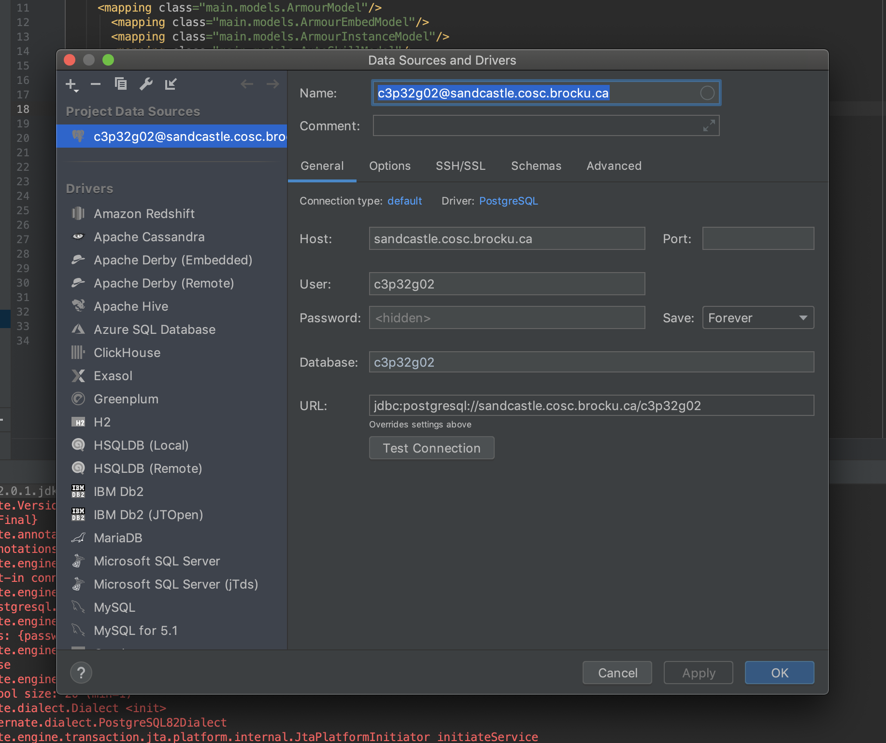
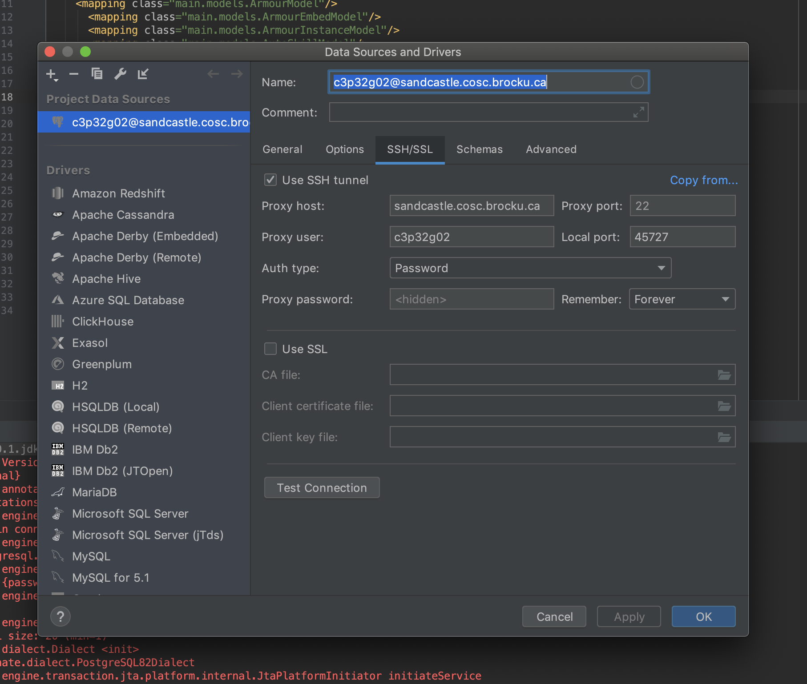

# 3p32 Group Project

Due Tuesday, 16 July 2019 @9 AM

### Getting Started

You should just be able to open the project in intelliJ as the .idea/ config is inculded in the repository, ignore prompts for adding database and try running. 

You might have some import errors, the libraries are in either libs/ or lib/, just add them from `Project Structure> Libraries > + `. 

There should be hibernate, jgoodies and postgres listed in there, if not, just import like i said in previos statement.

use `DbTest.java` to test if the db connection and ssh tunnel is functional. If not, go to the databases pane, (should be on the right, if not you can add it from view or something) click on the c3p32g02 db and make sure it is set up correctly. (see below). If it's still wonky with correct setup, changing local port to something random and changing back helped. (Possibly some process is still listenting there so ij can't? no idea it's weird)

hibernate config should look something like this: -

```xhtml
<?xml version='1.0' encoding='utf-8'?>
<!DOCTYPE hibernate-configuration PUBLIC
    "-//Hibernate/Hibernate Configuration DTD//EN"
    "http://www.hibernate.org/dtd/hibernate-configuration-3.0.dtd">
<hibernate-configuration>
  <session-factory>
    <property name="connection.username">c3p32g02</property>
    <property name="connection.password">d5e6j4v9</property>
    <property name="connection.url">jdbc:postgresql://localhost:45727/c3p32g02</property>
    <property name="connection.driver_class">org.postgresql.Driver</property>
    <mapping class="main.models.ArmourModel"/>
      <mapping class="main.models.ArmourEmbedModel"/>
      <mapping class="main.models.ArmourInstanceModel"/>
      <mapping class="main.models.AutoSkillModel"/>
      <mapping class="main.models.CharacterModel"/>
      <mapping class="main.models.ClanModel"/>
      <mapping class="main.models.ClanMemberModel"/>
      <mapping class="main.models.ClazzModel"/>
      <mapping class="main.models.ClassEquipmentModel"/>
      <mapping class="main.models.EarnedSkillModel"/>
      <mapping class="main.models.EquipmentModel"/>
      <mapping class="main.models.GemModel"/>
      <mapping class="main.models.HasEarnedModel"/>
      <mapping class="main.models.MainEmbedModel"/>
      <mapping class="main.models.MainWeaponModel"/>
      <mapping class="main.models.MainWeaponInstanceModel"/>
      <mapping class="main.models.SecondaryEmbedModel"/>
      <mapping class="main.models.SecondaryEquipmentModel"/>
      <mapping class="main.models.SecondaryEquipmentInstanceModel"/>
      <mapping class="main.models.SkillModel"/>
    <!-- DB schema will be updated if needed -->
    <!-- <property name="hibernate.hbm2ddl.auto">update</property> -->
  </session-factory>
</hibernate-configuration>
```

Database configuration should look something like this: - 

Local port needs to be the same as that in hibernate.config.xml





Be sure to run through the hibernate process, and have a `hibernate.cfg.xml` file that works for your machine. The `connection.url` property will be different.

Also be sure to add the following before any of the `mapping` properties.
```
<property name="connection.username">c3p32g02</property>
<property name="connection.password">d5e6j4v9</property>
```

### Schema

All the sql is located in `sql/`

`schema.psql`: Table creation code

`drop_all.sql`: Code to drop every table

`dummy_data.sql`: sql to add dummy data

`triggers.sql`: Sql to add triggers

`drop_triggers.sql`: Sql to drop all triggers

### Server

`ssh c3p32g02@sandcastle.cosc.brocku.ca` to login. Enter password `d5e6j4v9` (Super secure to put it up here, I know) check your emails for the password.

type login and press enter to open the postgres terminal for our database.

##### Useful Scripts: -

./`update_sql.sh`: deploy changes from this repo to the psql database. 

Note: The script drops every table and recreates them. (just runs drop_table.sql and then schema.psql as of right now)

./`reset-data.sh`: Delete all data from tables. This recreates the tables after dropping them.

`login`: to open psql terminal (Or just use the `grp_psql.sh` script, login is just an alias, this is just so you don't need to enter the password)


### Todo

Would be helpful to have a script to add dummy data. Add that to update_sql.

### ER Diagram
https://www.draw.io/#G17ShW0CAUOEnBLl88cmvr-g9rNtZNtuZH


